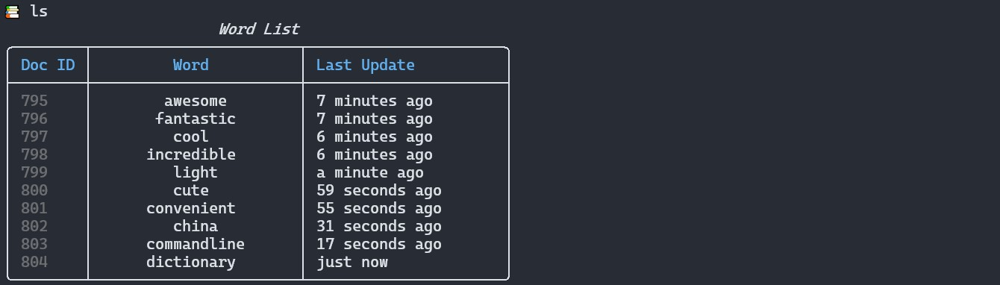
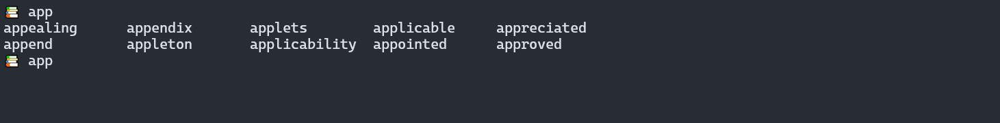

# CMDictionary

This is a **light**, **pure** and **convenient** commandline dictionary that helps you focus on memorizing words.

## Features

### Detailed Help Information


### Detailed Explanations and Examples


### Track Your Recently-Memorized Words


### Auto-Completion 

**Note**: The suggestions are ranked by word frequencies.

## Note

1. You need to use [Windows Terminal](https://github.com/microsoft/terminal) to see the emojis.
2. The program will download a set of words from NLTK if your path does not contain it. This may takes a few seconds.
3. You need internet connection to get the meanings of words.

## Install Dependency

```
pip install -r requirements.txt
```

## Run

```
python -u main.py
```

## TODO List
- [x] Add cache to reduce requests.
- [ ] Add args to toggle emoji output.
- [x] Add vocabulary auto-completion support.
- [ ] Release python module.