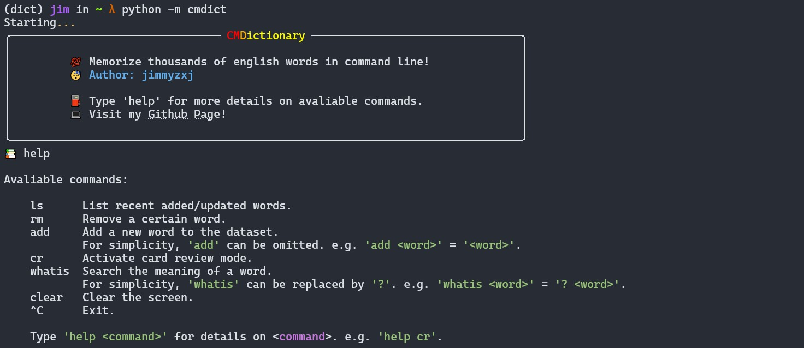

# CMDictionary

This is a **light**, **pure** and **convenient** commandline dictionary that helps you focus on memorizing words.

## Features

### Detailed Help Information


### Detailed Explanations and Examples


### Track Your Recently-Memorized Words


### Auto-Completion (Experiment)

**Note**: The suggestions are ranked by word frequencies. Unfortunately, windows system is not compatible with python `tab` completion. See details [here](https://stackoverflow.com/questions/1081405/python-tab-completion-in-windows).

## Note

1. You may need to use [Windows Terminal](https://github.com/microsoft/terminal) to see the emojis.
2. You need internet connection to get the meanings of words at the first time.

## OS
1. Linux
2. Windows
3. MacOS (Not tested yet)
## Install

```
python setup.py install
```

## Run

```
python -m cmdict
```

## TODO List
- [x] Add cache to reduce requests.
- [ ] Add args to toggle emoji output.
- [x] Add vocabulary auto-completion support.
- [x] Release python module.